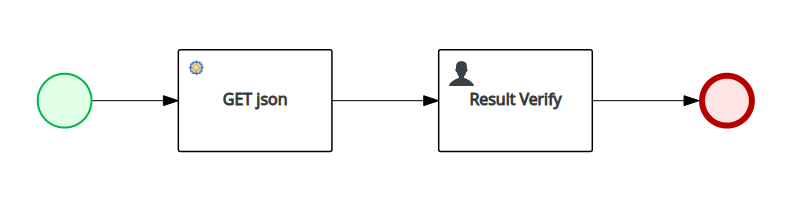

# PAM Sample Process for Openshift

Simple business process that makes a REST call to [jsonplaceholder](https://jsonplaceholder.typicode.com/) and assigns a user task

## Get Started

* Openshift environment. For local development with [Red Hat](https://www.redhat.com) supported images it is recommended to use the [Container Development Kit](https://developers.redhat.com/products/cdk/download/). Additional documentation can be found at the upstream project [minishift](https://docs.okd.io/latest/minishift/getting-started/index.html)

* Install [Red Hat Process Automation Manager](https://www.redhat.com/en/technologies/jboss-middleware/process-automation-manager) using the [rhpam7-install-demo](https://github.com/jbossdemocentral/rhpam7-install-demo) repository

* Import this git project

* Test the end to end running of this process by importing `PAM.postman_collection.json` into [Postman](https://www.getpostman.com/)
  * You will need to edit the existing `KIE` environment variable to be the URL of the kie deployment in your Openshift environment

## Exporting from Openshift

* Run the `ssh-port-forward.sh` script to forward localhost connections to the business central pod

* Run the `git-clone.sh` script to pull down the git repo from Openshift to local. Use the credentials for the **pamAdmin** user from the **rhpam7-demo-install**